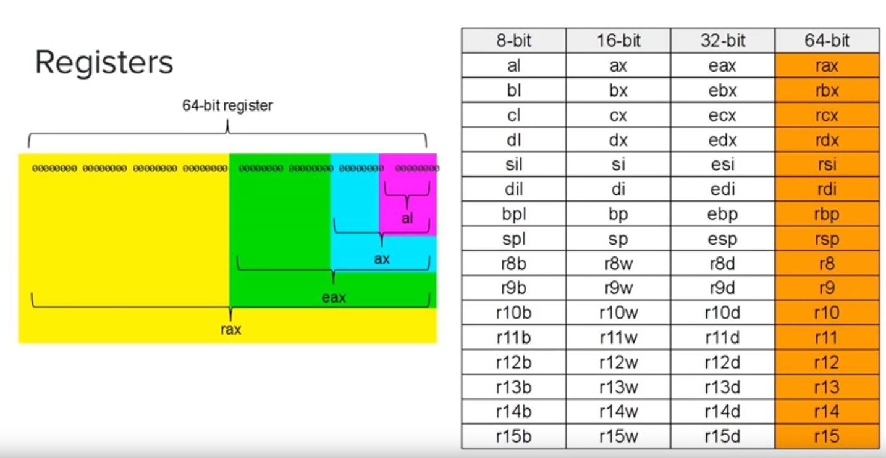

# Learning Assembly x86_64 in Linux
- [Tutorials](https://www.youtube.com/playlist?list=PLetF-YjXm-sCH6FrTz4AQhfH6INDQvQSn)

## System calls
[System calls](https://blog.rchapman.org/posts/Linux_System_Call_Table_for_x86_64/)

#### sys_write
- file descriptor: standard_input = 0, standard_output = 1, standard_error = 2
- buffer: memory location of the message
- count: length of message

| action | rax | rdi | rsi | rdx | r10 | r8 | r9 |
| :----- | :-- | :-- | :-- | :-- | :-- | :- | :- |
| output string to console | syscall: 1 | filedesc: 1 | buffer: ADDR | count: (int) | | | | |

#### Registers

