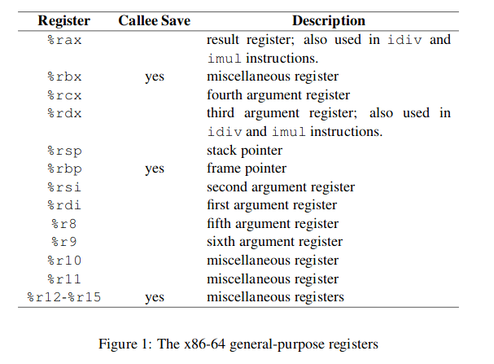

# Learning Assembly x86_64 in Linux
- [Tutorials](https://www.youtube.com/playlist?list=PLetF-YjXm-sCH6FrTz4AQhfH6INDQvQSn)

# System calls
[System calls](https://blog.rchapman.org/posts/Linux_System_Call_Table_for_x86_64/)

#### sys_write
- file descriptor: standard_input = 0, standard_output = 1, standard_error = 2
- buffer: memory location of the message
- count: length of message

| action | rax | rdi | rsi | rdx | r10 | r8 | r9 |
| :----- | :-- | :-- | :-- | :-- | :-- | :- | :- |
| echo | sys_write: 1 | standard_output 1 | buffer: ADDR | count: (int) | | | | |
| readline | sys_read: 0 | standard_input: 0 | 
| exit | sys_exit: 60 | error_code: 0 | | |  | | | |

# Examples
### Hello World
```asm
section .data
    text1 db "Hello World",10  ; ,10 = \n

section .text
    global _start
  
_start:
    CALL _print_hello

    ; exit program
    MOV RAX, 60
    MOV RDI, 0
    syscall
  
_print_hello:
    MOV RAX, 1      ; sys_write
    MOV RDI, 1      ; standard_output
    MOV RSI, text1  ; stored string
    MOV RDX, 12     ; length of string
    RET
```

### Run asm code
1. Create `run`:
  ```bash
  # compile object file
  nasm -f elf64 -o ${1}.o ${1}.asm 
  # create executable
  ld ${1}.o -o ${1}
  # run executable
  ./${1}
  # clean up
  rm ${1}.o ${1}
  ```
2. Enable `run`:
  ```bash
  chmod +x run
  ```
3. Run (ex: run hello.asm):
  ```bash
  ./run hello
  ```

### Echo
```asm
section .bss
    name resb 16  ; reserve 16 bytes for $name
    
section .data
    hello db "Hello "
    query db "What is your name?: "
    
section .text
    global _start
    
_start:
    call _getName
    
_getName:
    mov rax, 0    ; sys_read
    mov rdi, 0    ; standard_input
    mov rsi, name ; load stored string
    mov rdx, 16   ; number of bytes
    syscall
    ret
_printName:
    mov rax, 1
    mov rdi, 1
    mov rsi, name
    mov rdx, 16
    syscall
    ret
_print_hello:
    MOV RAX, 1      ; sys_write
    MOV RDI, 1      ; standard_output
    MOV RSI, text1  ; stored string
    MOV RDX, 12     ; length of string
    RET    
```
# Registers
[](https://www.classes.cs.uchicago.edu/archive/2009/spring/22620-1/docs/handout-03.pdf)

