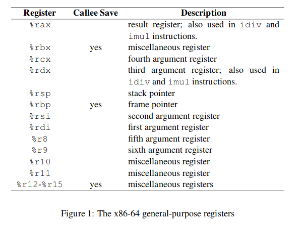

# Learning Assembly x86_64 in Linux
- [Tutorials](https://www.youtube.com/playlist?list=PLetF-YjXm-sCH6FrTz4AQhfH6INDQvQSn)

# System calls
[System calls](https://blog.rchapman.org/posts/Linux_System_Call_Table_for_x86_64/)

#### sys_write
- file descriptor: standard_input = 0, standard_output = 1, standard_error = 2
- buffer: memory location of the message
- count: length of message

| action | rax | rdi | rsi | rdx | r10 | r8 | r9 |
| :----- | :-- | :-- | :-- | :-- | :-- | :- | :- |
| echo | sys_write: 1 | standard_output 1 | buffer: ADDR | count: (int) | | | | |
| readline | sys_read: 0 | standard_input: 0 | 
| exit | sys_exit: 60 | error_code: 0 | | |  | | | |

# Examples
### Hello World
```asm
section .data
    text1 db "Hello World",10  ; ,10 = \n

section .text
    global _start
  
_start:
    CALL _print_hello

    ; exit program
    MOV RAX, 60
    MOV RDI, 0
    syscall
  
_print_hello:
    MOV RAX, 1      ; sys_write
    MOV RDI, 1      ; standard_output
    MOV RSI, text1  ; stored string
    MOV RDX, 12     ; length of string
    RET
```

### Run asm code
Create a file so that we can easily run programs from a given .asm file input by doing `./run programname`.

[run](code/run.md)

### Echo
Get string from standard input using sys_read, then output it using sys_write: [echo.asm](examples/echo.asm)

# Registers
[](https://www.classes.cs.uchicago.edu/archive/2009/spring/22620-1/docs/handout-03.pdf)

