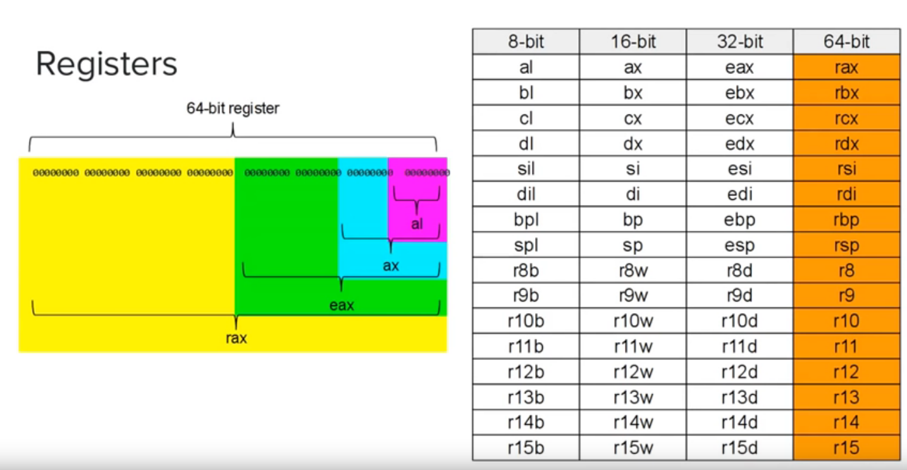

# Learning Assembly x86_64 in Linux
- [Tutorials](https://www.youtube.com/playlist?list=PLetF-YjXm-sCH6FrTz4AQhfH6INDQvQSn)

# System calls
[System calls](https://blog.rchapman.org/posts/Linux_System_Call_Table_for_x86_64/)

### sys_write
| action | rax | rdi | rsi | rdx | r10 | r8 | r9 |
| :----- | :-- | :-- | :-- | :-- | :-- | :- | :- |
| echo     | `sys_write` 1  | `standard_output` 1  | `buffer` ADDR | `str length` (int) | | | | |
| readline | `sys_read` 0   | `standard_input` 0   | | |  | | | |
| exit     | `sys_exit` 60  | `error_code` 0       | | |  | | | |

# Examples
### Run asm code
Create a file so that we can easily run programs from a given .asm file input by doing `./run programname`.

[run](code/run.md)

### Hello World
Write "Hello World" to the console. [hello.asm](examples/hello.asm)

### Echo
Get string from standard input using sys_read, then output it using sys_write: [echo.asm](examples/echo.asm)

---

# Registers

