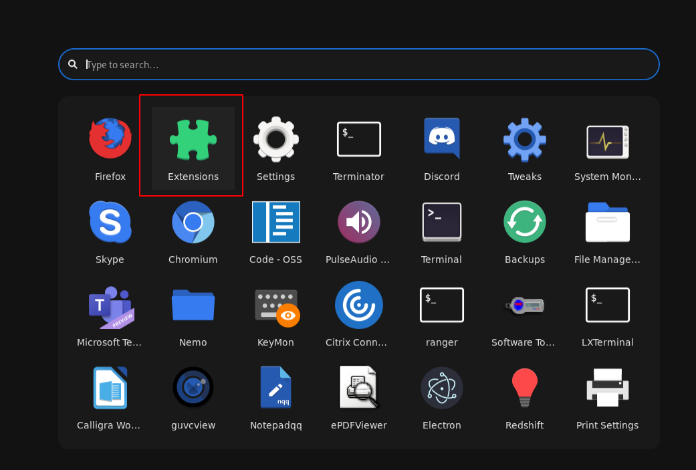
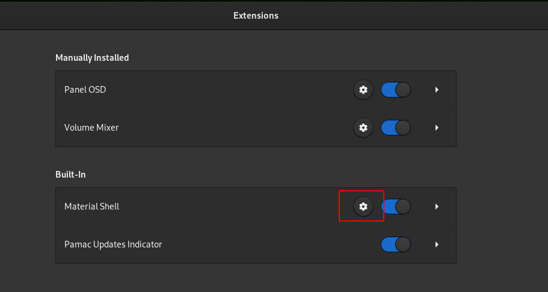
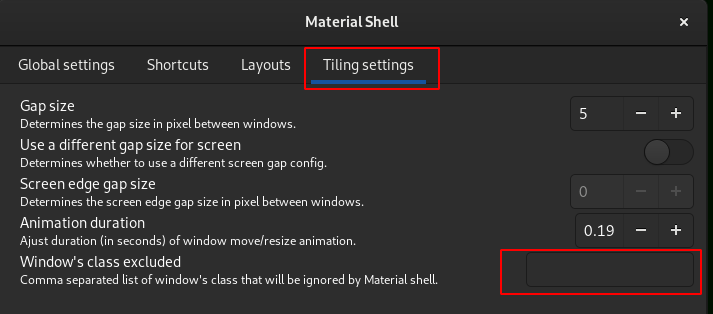
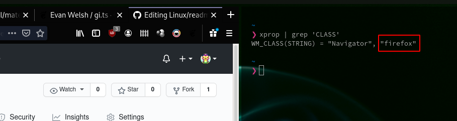

- 1 - [Navigate to material-shell settings](#1---navigate-to-material-shell-settings)
- 2 - [Exclude window classes](#2---exclude-window-classes)
- [Fixes](#Fixes)

# 1 - Navigate to material-shell settings

# 2 - Exclude window classes
Sometimes, you want an application to create windows that are not managed by material-shell. For example, when an application creates popup windows that are not recognized as such. In that case you can go to `extensions > material-shell | options > tiling settings > Window's class excluded.` See also chapter 1.

To know what to type in, make sure you have the application open that you want to exclude, then press alt+F2. Type in `lg` in the input field that pops up, press enter. A popdown terminal window will appear. Click on `Windows` on the topleft. Now you can lookup the wmclass name in the list.

An alternative way is opening a terminal, typing `xprop | grep 'CLASS'`, hit enter, and then click on the window of interest. The wmclass will then be the second value that is returned.

# Fixes
This section has a list of people who reported problems, and how they described they fixed it.

### Constant crashes on Ubuntu 20.04
> I previously had a problem with material shell on ubuntu 20.04. Every few minutes it crashed. I (at least for me) found a fix, which is to install GNOME session and use that instead of the default Ubuntu one (`sudo apt install -y gnome-session`).
